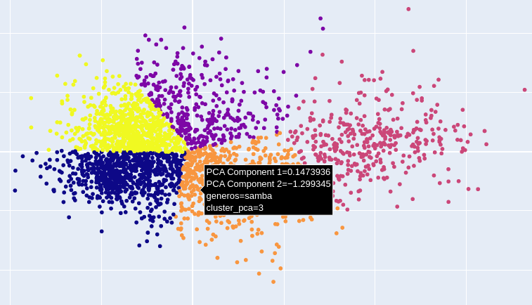

# Music Recommender System

## Overview

Welcome to the Music Recommender System! This program is designed to provide personalized music recommendations based on your listening history and preferences. Using advanced data processing and machine learning techniques, it clusters songs and genres to suggest music that aligns with your taste.

## Features

- **Data Processing**: The program processes music data, filtering out irrelevant columns and focusing on key attributes like tempo, loudness, and energy.
- **Genre Clustering**: Utilizes PCA (Principal Component Analysis) and KMeans clustering to categorize music genres into distinct clusters.
- **Music Recommendation**: Based on the song you just listened to, the system recommends a list of similar songs by calculating the Euclidean distances in the feature space.
- **Interactive Visualization**: Provides an interactive scatter plot that visualizes genre clusters, allowing you to explore the relationships between different music genres.
- **OneHot Encoding for Artists**: Handles categorical data by encoding artist names, ensuring that the machine learning models can process them effectively.

## How It Works

1. **Data Loading**: The program reads music data from CSV files, which contain detailed information about various songs and genres.
2. **Data Cleaning**: Unnecessary columns are removed to streamline the dataset, focusing on the most relevant features.
3. **Dimensionality Reduction**: PCA is applied to reduce the feature space to two principal components, making it easier to visualize and cluster the data.
4. **Clustering**: KMeans clustering algorithm groups the songs and genres into clusters based on their features.
5. **Recommendation Algorithm**: When a user inputs the name of a song they just listened to, the program finds the closest songs within the same cluster and recommends the top matches.
6. **Interactive Visualization**: An interactive plot created using Plotly shows the genre clusters, and you can hover over points to see the names of genres.

## Usage

1. **Clone the Repository**:
   ```bash
   git clone https://github.com/yourusername/music-recommender.git
   cd music-recommender
   ```

2.**Prepare the Data**:
   Ensure your CSV files (Dados_totais.csv, data_by_genres.csv, and data_by_year.csv) are placed in a directory named data. Obs: The data might get old through time, it only conteins music < 2020, the total set contains ≈20k music. 
   
3.**Run the Program**: 
Execute the script to start the recommendation system.

4.**Get Recommendations**:
Every music follows the padron of the column 'artists_song' Band - Music (Coldplay - Yellow), the input expects to be written this way. If the song isn't on the data, will send a fail massage.

5.**Dependecies**:
Pandas, Numpy, Scikit-learn, Plotly
6.**Last Observation**:
This program was made by me whitch is brazilian, the name of variables are in portuguese, sorry about that.
